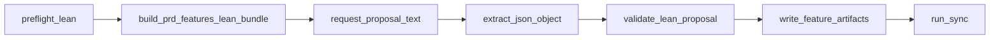

# Plano: `generate features` lean + IA como caminho canónico

## Contexto fixo

- Implementação em [C:\Users\NPBB\fabrica](C:\Users\NPBB\fabrica); consumo com `--repo-root` no repo operacional (ex. [npbb](c:\Users\NPBB\npbb)).
- **Markdown** = fonte de verdade; **Postgres** = espelho derivado via sync existente.
- Sem skills de editor como runtime; provider = HTTP OpenAI-compatible (v1).

### Objetivos macro

- **Decompor o PRD em features:** combinar **determinismo** nos passos em que for **necessário e possível** (preflight lean, bundle `prd_features_lean/v1`, extração e `validate_lean_proposal`, render para markdown) com **inferência por IA** via **OpenRouter** (provider OpenAI-compatible, `temperature=0`, variáveis `FABRICA_FEATURES_*` / `OPENROUTER_API_KEY`; fluxo canónico e módulo `prd_features_provider.py` abaixo).
- **Persistência:** o estado canónico em **markdown** é o que importa para o produto; **Postgres** persiste o **espelho** via **sync** após `write_feature_artifacts`. A **proposta JSON** bruta do modelo **fica fora do Postgres no v1** (racional na revisão “Não persistir a proposta JSON no Postgres”).

### Carregamento de `.env` no repo operacional (ligado ao provider)

- **Objectivo:** com `python ... fabrica.py --repo-root C:\...\npbb`, as variáveis `OPENROUTER_API_KEY`, `FABRICA_FEATURES_PROVIDER_MODEL`, `FABRICA_BUILDER_MODEL`, etc. passam a ser lidas de ficheiros **gitignored** no npbb, sem obrigar a copiar tudo para o PowerShell em cada sessão.
- **Ordem sugerida** (cada ficheiro ignorado se não existir):
  1. `{repo_root}/.env` — opcional; pode concentrar só chaves da Fabrica / OpenRouter.
  2. `{repo_root}/backend/.env` — opcional; reutiliza o `.env` que muitos projetos já têm para o FastAPI (chave OpenRouter pode viver aqui).
- **Mesma chave nos dois ficheiros:** com `override=False`, a **primeira** leitura que definir a variável ganha (tipicamente raiz antes de `backend/`); evita surpresas mudando só um dos ficheiros.
- **Regra 12-factor:** **não** sobrescrever `os.environ` para chaves **já definidas** no processo (shell/CI); só preencher omissões.
- **Segurança:** manter `.env` / `.env.*` no `.gitignore` do repo operacional (no npbb já existe); nunca commitar chaves.
- **Onde implementar:** entrada da CLI em `fabrica` (ex. [`fabrica.py`](C:\Users\NPBB\fabrica\scripts\fabrica.py)), **imediatamente após** resolver `repo_root` e **antes** de qualquer comando que chame `load_features_provider_config` (e futuros comandos de composição com o mesmo provider).
- **Dependência:** o ADR original pedia “sem novas dependências Python”; um parser **mínimo** `KEY=VAL` em stdlib cumpre; se o repo `fabrica` já tiver ou aceitar `python-dotenv`, pode usar `load_dotenv(..., override=False)`.

---

## Filosofia do produto (revisão)

### As três variantes (`--proposal-file`, `--bundle-only`, `--legacy`) são indicadas?

**Sim, com papéis distintos — nenhuma delas é “fallback quando não há IA”.**

- **`--proposal-file`:** Vale a pena **manter**. Não contradiz “a ferramenta é baseada em IA”: o fluxo **mental** do utilizador continua a ser “modelo → proposta JSON → validação → markdown”. A flag serve a **automação** (CI), **reexecução sem custo** (mesma proposta, novo render após mudar template), e **colar saída crua** de um chat noutro sítio. Isto é padrão em ferramentas que chamam LLMs (dry-run / from-file). O que **não** faz sentido é usar isto como **substituto silencioso** quando a API falha — aí o comportamento correcto é **erro claro** no modo **padrão** (sem flags).

- **`--bundle-only`:** Vale a pena **manter** para **composição**: outro processo (outro agente, outro endpoint, política de dados) consome o bundle sem passar pela CLI de chat. Sem isto, obrigas copy-paste manual do JSON.

- **`--legacy`:** Vale a pena **manter por agora** só como **válvula de migração**: repositórios que ainda dependem do heurístico + merge em [`prd_features.py`](C:\Users\NPBB\fabrica\scripts\fabrica_core\prd_features.py). **Não** deve aparecer na mensagem de erro do modo padrão como “alternativa natural”; no máximo uma linha secundária “projetos não migrados: `--legacy`” se quiseres documentação explícita. Podes marcar como **deprecated** no help e planear remoção numa v2 quando o tráfego for zero.

**Síntese alinhada contigo:** Se **não há IA disponível** (config incompleta), o **default** falha com **erro explícito** — **sem** saltar para legado **nem** fingir que `--proposal-file` existe “por defeito”. O utilizador ou **configura** `FABRICA_FEATURES_*`, ou **opta** explicitamente por `--proposal-file` (já tem JSON), ou **`--bundle-only`** (só contexto), ou **`--legacy`** (excepção herdada).

### Não persistir a proposta JSON no Postgres — é o melhor caminho?

**Para o v1, sim — com ressalva honesta.**

- **Vantagens de não persistir:** Um só lugar de verdade operacional para o **estado do produto** (markdown + sync); menos superfície de schema, menos drift entre versões do contrato lean; menos preocupação com retenção/PII em texto de modelo.
- **Desvantagens:** Perdes **auditoria forense** (“o que o modelo devolveu antes do validador cortar?”), **replay** após mudanças no validador, e **atribuição de custo** por proposta no DB (podes ainda medir no provider).

**Conclusão:** Manter **fora do Postgres** no âmbito deste plano é coerente com “markdown SoT + espelho”. Se no futuro auditoria ou compliance exigirem, um **seguinte** incremento seria append-only (ex. ligado a `sync_run` ou tabela de auditoria), **sem** tornar JSON concorrente ao markdown como SoT.

---

## Comportamento canónico da CLI

### Modo padrão (sem flags de modo)

`fabrica generate features --project SLUG [--repo-root R]`

0. (Bootstrap) Carregar `{R}/.env` e `{R}/backend/.env` se existirem, sem pisar variáveis já exportadas no shell.
1. `preflight_lean_prd_to_features` (extraído de [`features_lean.py`](C:\Users\NPBB\fabrica\scripts\fabrica_core\features_lean.py)): PRD existe, intake existe, sem `features/FEATURE-*`, gates de backlog lean no PRD.
2. `build_prd_features_lean_bundle` → dict `prd_features_lean/v1` (intake **obrigatório** no disco; `intake_path` sempre preenchido).
3. `load_features_provider_config` → se **inválido/ausente**, **ValueError** (ou exit 1) com mensagem acionável (**sem** escrita parcial, **sem** sync).
4. `request_proposal_text` (POST OpenAI-compatible `/chat/completions`, `temperature=0`).
5. `extract_json_object_from_model_output` → dict.
6. `validate_lean_proposal` → `write_feature_artifacts` → `_run_sync` com trigger **`fabrica.generate.features`**.

### Três variantes explícitas (opt-in)

| Flag | Papel | Provider | validate/render | sync |
|------|--------|----------|-----------------|------|
| *(default)* | Canónico IA | sim | sim | `fabrica.generate.features` |
| `--proposal-file` | Offline lean (CI, replay, colar resposta) | não | sim | `fabrica.generate.features` |
| `--bundle-only` [+ `--bundle-out`] | Só serializa bundle v1 | não | não | não |
| `--legacy` | Heurístico [`generate_features`](C:\Users\NPBB\fabrica\scripts\fabrica_core\generation.py) | não | sim (legado) | `fabrica.generate.features.legacy` |

### Regras de exclusão (argparse)

- `--legacy` **não** combina com `--proposal-file`, `--bundle-only`, `--bundle-out`.
- `--bundle-only` **não** combina com `--proposal-file`.
- `--bundle-out` **só** com `--bundle-only`.
- `--agent-id`: válido em modo IA, `--proposal-file`, `--bundle-only`; **inválido** com `--legacy`.
- **`--lean`:** alias compatível, **sem efeito semântico** nesta iteração (não quebra scripts antigos).

### Erro quando a IA não está disponível (modo padrão)

- Mensagem deve pedir: configurar `FABRICA_FEATURES_PROVIDER_*` (e fallbacks documentados), **ou** colocar `OPENROUTER_API_KEY` / modelo num `.env` em `--repo-root` ou `backend/.env` (gitignored), **ou** usar `--proposal-file` se já tiverem JSON, **ou** `--bundle-only` para só exportar contexto.
- **Não** listar `--legacy` como solução principal; opcional mencionar só como migração de projetos antigos.

---

## Módulo `prd_features_provider.py`

- `FeaturesProviderConfig` (tipado).
- `load_features_provider_config(env)`:
  - `FABRICA_FEATURES_PROVIDER_BASE_URL` default `https://openrouter.ai/api/v1`
  - `FABRICA_FEATURES_PROVIDER_MODEL` fallback `FABRICA_BUILDER_MODEL`
  - `FABRICA_FEATURES_PROVIDER_API_KEY` fallback `OPENROUTER_API_KEY`
  - `FABRICA_FEATURES_PROVIDER_TIMEOUT_SECONDS` default `3000` (E2E com OpenRouter, repair e fallback de structured outputs costuma exceder 120s; override por env quando necessário)
- `request_proposal_text(bundle_dict, *, config, http_post=...) -> str` — injeção de `http_post` para testes.
- `extract_json_object_from_model_output(text) -> dict[str, object]` — JSON puro, fenced ```json, ruído antes/depois, conteúdo string vs lista de partes; erro claro se não houver objeto raiz.
- Protocolo v1: POST `/chat/completions`, OpenAI-compatible, `temperature=0`; normalizar modelo: remover prefixo `openrouter/` antes de enviar; **sem** Anthropic nativo nesta rodada.
- System/user messages **curtas no código**: exigir **um único** objeto JSON compatível com `validate_lean_proposal`; bundle serializado no user message.

---

## `features_lean.py` e bundle

- Extrair **`preflight_lean_prd_to_features(paths)`** (ou nome equivalente) reutilizando a lógica actual de [`_validate_prd_preflight`](C:\Users\NPBB\fabrica\scripts\fabrica_core\features_lean.py).
- Helpers: parse texto → dict (reutilizar extração robusta para **IA e** `--proposal-file`), validar dict → `LeanProposal`, render a partir de `LeanProposal`.
- [`build_prd_features_lean_bundle`](C:\Users\NPBB\fabrica\scripts\fabrica_core\prd_features_bundle.py): falhar se intake em falta; `intake_path` sempre string no bundle canónico.
- Ajuste mínimo a [`_PROPOSAL_INVARIANTS`](C:\Users\NPBB\fabrica\scripts\fabrica_core\prd_features_bundle.py) se ainda disserem que validação `blocked` é só no builder.

---

## `generation.py` / hot path

- [`generate_features`](C:\Users\NPBB\fabrica\scripts\fabrica_core\generation.py) **só** com `--legacy`. `prd_features_lean.py` fora do hot path salvo quebra de import.

---

## Testes (resumo)

- Config híbrida + fallbacks; normalização de modelo; `extract_json_object_from_model_output` (casos da spec).
- Preflight: sem intake, PRD com backlog, features já existentes.
- CLI black-box: IA com stub HTTP, escrita + trigger `fabrica.generate.features`; erro de config sem escrita/sync; `--proposal-file` sem `--lean`; `--bundle-only` stdout/`--bundle-out` sem sync; `--legacy` + trigger legacy; flags inválidas; repo temporário com `.env` só com chaves provider e `override=False` comportamento.
- Regressões lean: só manifestos + dirs `user-stories/` e `auditorias/` vazios; `agent_id` opaco; Postgres só via sync.

---

## Riscos residuais

- Custo API + falha na validação JSON após resposta.
- Contexto limitado (`_ITEM_BUDGET`).
- `--legacy` prolonga dois mundos até remoção.
- Consumidores de `build_prd_features_lean_bundle` sem intake quebram (breaking aceite).

---

## Diagrama do fluxo canónico



---

## Especificação aprovada para implementação (Codex)

**Status:** aprovado conforme mensagem do utilizador (default IA, variantes explícitas, sem novas dependências Python).

**Refinamentos em relação a rascunhos anteriores:**

- Bootstrap `.env` sob `--repo-root` conforme secção “Carregamento de `.env`”; documentar no README da `fabrica` e, se útil, uma linha no [README do npbb](c:\Users\NPBB\npbb\README.MD) na secção Framework Fabrica.
- Cobertura de testes **apenas** em [`tests/`](c:\Users\NPBB\fabrica\tests) (`test_prd_features_provider.py`, `test_lean_preflight.py`), não em `scripts/fabrica_core/tests/`.
- HTTP do provider v1 só com **stdlib** (`urllib.request`); sem SDKs novos.
- Com `--bundle-out PATH`: escrever **só** no ficheiro, **sem** duplicar bundle em stdout.
- Atualizar [`tests/test_governance_docs.py`](C:\Users\NPBB\fabrica\tests\test_governance_docs.py) para o default IA e papel secundário de `--proposal-file` / `--legacy`.
- `blocked=true` na proposta: **exit 1**, sem escrita parcial e sem sync (falha operacional).
- `--legacy` incompatível com `--agent-id` (alinhado ao spec completo).

**Comando de verificação:** `python -m pytest tests/ -q` a partir da raiz do repo `fabrica`.
