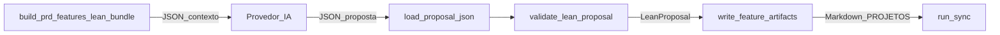

# ADR (mini): comando único PRD→Features com IA (lean)

## Contexto fixo (aceito)

- Implementação em [C:\Users\NPBB\fabrica](C:\Users\NPBB\fabrica); consumo operacional com `--repo-root` apontando para o repo do projeto (ex.: [npbb](c:\Users\NPBB\npbb)).
- **Markdown em disco** continua sendo a fonte de verdade; **Postgres** é espelho via sync existente ([`cli.py`](C:\Users\NPBB\fabrica\scripts\fabrica_core\cli.py) chama `_run_sync` após gerar).
- **Não** usar skills de editor como runtime; apenas CLI/biblioteca e (opcionalmente) chamada HTTP/SDK ao provedor.

## 1. Desenho alvo do “comando único” com IA

**Alvo:** um único caminho de produto para “PRD → manifestos de feature” quando se quer decomposição assistida por modelo:

1. Montar o **context bundle** lean (`prd_features_lean/v1`) a partir do PRD + governança + metadados — **sem** colocar o corpo inteiro do PRD no bundle ([`full_prd_in_bundle: False`](C:\Users\NPBB\fabrica\scripts\fabrica_core\prd_features_bundle.py)).
2. O modelo recebe esse bundle (+ instruções fixas nas `rules`) e devolve **somente JSON** estruturado (invariante declarado em [`_PROPOSAL_INVARIANTS`](C:\Users\NPBB\fabrica\scripts\fabrica_core\prd_features_bundle.py)).
3. A CLI (ou orquestrador) faz **parse** → **validate** → **render Markdown** → **sync**.

O estado atual da CLI já separa explicitamente:

- **Legado:** `generate features` → [`generate_features`](C:\Users\NPBB\fabrica\scripts\fabrica_core\generation.py) (determinístico, **sem** chamada a provedor): `build_prd_feature_bundle` → `proposal_from_legacy_prd` → `validate_prd_feature_proposal` → `render_prd_feature_proposal`.
- **Lean (hoje):** `generate features --lean --proposal-file` → [`generate_features_lean`](C:\Users\NPBB\fabrica\scripts\fabrica_core\features_lean.py): JSON externo → `validate_lean_proposal` → escrita de manifestos. O help da CLI diz que **não chama provider nesta iteração** ([`cli.py` L59–62](C:\Users\NPBB\fabrica\scripts\fabrica_core\cli.py)).

**Conclusão:** o “comando único com IA” é a **união** do builder de bundle ([`build_prd_features_lean_bundle`](C:\Users\NPBB\fabrica\scripts\fabrica_core\prd_features_bundle.py)) com o pipeline já existente de validação/render lean ([`generate_features_lean`](C:\Users\NPBB\fabrica\scripts\fabrica_core\features_lean.py)), mais um passo de **invocação do provedor** ainda não presente na CLI.

## 2. Contrato que sobrevive no fluxo novo

| Camada | Contrato canônico |
|--------|-------------------|
| **Persistência / SoT** | Árvore `PROJETOS/...` em Markdown (manifestos gerados por [`write_feature_artifacts`](C:\Users\NPBB\fabrica\scripts\fabrica_core\features_lean.py)). |
| **Contexto para o modelo** | JSON do bundle: `schema_version` = `prd_features_lean/v1`, `stage` = `PRD_TO_FEATURES`, evidências fatiadas em `prd_evidence`, `read_policy`, `rules`, `project_metadata`, `runtime_inputs` ([`PrdFeaturesLeanBundle.to_dict`](C:\Users\NPBB\fabrica\scripts\fabrica_core\prd_features_bundle.py)). |
| **Saída do modelo (entrada da Fabrica)** | Objeto JSON validado por [`validate_lean_proposal`](C:\Users\NPBB\fabrica\scripts\fabrica_core\features_lean.py): `project`, `prd_path`, `blocked`/`blockers`/`features`, `agent_id` opcional; cada feature com `prd_evidence` como **lista de objetos** `{section, basis}`, `behavior_expected`, `layer_impacts` obrigatório por camada, etc. |
| **Espelho** | Sync pós-geração (já integrado em [`cli.py`](C:\Users\NPBB\fabrica\scripts\fabrica_core\cli.py)). |

O contrato **legado** de proposta (`FeatureProposal` / [`validate_prd_feature_proposal`](C:\Users\NPBB\fabrica\scripts\fabrica_core\prd_features.py): `expected_behavior`, `prd_evidence` como **strings**, `user_story_seeds` obrigatórios, `intake_path` no payload) **não** é o contrato do fluxo IA-first; no máximo permanece como **caminho alternativo** (`generate features` sem `--lean`) para heurística/compatibilidade até remoção explícita.

## 3. Incompatibilidades reais lean vs legado

1. **Forma de `prd_evidence`:** lean exige objetos `{section, basis}` ([`_validate_feature` em `features_lean.py`](C:\Users\NPBB\fabrica\scripts\fabrica_core\features_lean.py)); legado exige lista de **strings** ([`prd_features.py`](C:\Users\NPBB\fabrica\scripts\fabrica_core\prd_features.py)).
2. **Nome do campo de comportamento:** `behavior_expected` (lean) vs `expected_behavior` (legado).
3. **User stories na proposta:** legado exige `user_story_seeds` validados por feature; lean **não** os inclui na proposta — o manifesto lean usa **placeholders** na seção 9 ([`_placeholder_story_rows`](C:\Users\NPBB\fabrica\scripts\fabrica_core\features_lean.py)).
4. **`intake_path` no JSON:** legado inclui e valida; lean valida só `project` + `prd_path` alinhados aos paths resolvidos (intake obrigatório como **arquivo** no preflight lean, mas não como campo do JSON).
5. **Regra de slug:** lean usa regex `MAIUSCULAS-COM-HIFEN` ([`_FEATURE_SLUG_RE`](C:\Users\NPBB\fabrica\scripts\fabrica_core\features_lean.py)); legado exige `slugify(feature_slug) == feature_slug` ([`prd_features.py`](C:\Users\NPBB\fabrica\scripts\fabrica_core\prd_features.py)) — pode rejeitar/aceitar conjuntos ligeiramente diferentes de slugs.
6. **Features já existentes:** lean **aborta** se já existir qualquer pasta `FEATURE-*` ([`_validate_prd_preflight`](C:\Users\NPBB\fabrica\scripts\fabrica_core\features_lean.py)); legado **carrega e mescla** por número, com regras de sobrescrita para manifestos `generated_by == fabrica-cli` ([`_load_existing_features`](C:\Users\NPBB\fabrica\scripts\fabrica_core\prd_features.py)).
7. **PRD “elegível”:** lean bloqueia PRD com IDs de backlog, certos headings/tabelas de backlog no corpo ([`_validate_prd_preflight`](C:\Users\NPBB\fabrica\scripts\fabrica_core\features_lean.py)). O legado em `generation.py` define bloqueadores **mais amplos** (ex.: critérios de aceite no PRD) em `_legacy_safe_feature_blockers`, usados noutro módulo — **não** estão acoplados ao `generate_features` atual em [generation.py L529–540](C:\Users\NPBB\fabrica\scripts\fabrica_core\generation.py), o que gera **dois “mundos” de elegibilidade** se ambos coexistirem sem documentar qual prevalece.
8. **Intake no bundle vs preflight:** [`build_prd_features_lean_bundle`](C:\Users\NPBB\fabrica\scripts\fabrica_core\prd_features_bundle.py) permite `intake_path: null` se o ficheiro não existir; [`validate_lean_proposal`](C:\Users\NPBB\fabrica\scripts\fabrica_core\features_lean.py) **exige** intake no disco — inconsistência operacional se alguém gerar bundle sem intake e esperar que o render passe.

**Regra de precedência em caso de conflito:** para o **fluxo com IA**, prevalece o contrato **lean** (`prd_features_lean/v1` + `validate_lean_proposal`). O legado é caminho paralelo; não se deve “misturar” propostas sem adaptador.

## 4. UX final proposta da CLI (flags e comportamento)

Sugestão alinhada ao “um comando” sem abandonar o modo offline:

| Flag / modo | Comportamento |
|-------------|----------------|
| `fabrica generate features --project SLUG --repo-root R` | **Padrão alvo (IA):** build lean bundle → chamar provedor (config por env / ficheiro) → parse JSON da resposta → `validate_lean_proposal` → escrita de manifestos → `sync` com trigger unificado (ex. `fabrica.generate.features` ou específico `.ai`). |
| `--dry-run-ai` (ou `--bundle-only`) | Emite o bundle JSON para stdout ou ficheiro (`--bundle-out`) **sem** chamar API; para pipelines externos. |
| `--proposal-file PATH` / `-` | **Modo atual lean:** não chama API; valida e renderiza (compatível com [`cli.py`](C:\Users\NPBB\fabrica\scripts\fabrica_core\cli.py) atual). |
| `--legacy` ou `generate features --no-lean` (nome a fechar) | Mantém apenas [`generate_features`](C:\Users\NPBB\fabrica\scripts\fabrica_core\generation.py) heurístico; útil enquanto existir necessidade de compatibilidade. |
| `--agent-id` | Opaco; continua a convergir com JSON ou CLI ([`_effective_agent_id`](C:\Users\NPBB\fabrica\scripts\fabrica_core\features_lean.py)). |

**Decisão de produto implícita:** retirar `--lean` como “modo especial” e torná-lo o **caminho default** com IA, mantendo `--proposal-file` para STDIN/pipe e testes — ou manter `--lean` como alias de “usa validador lean” para não quebrar scripts; isso é só nomenclatura, o contrato é o mesmo.

## 5. Call flow exato (bundle → IA → parse → validate → render → sync)

Detalhe:

1. **Bundle:** `build_prd_features_lean_bundle(project_slug, repo_root, agent_id?)` → serializar `to_dict()` para o prompt/tooling.
2. **IA:** entrada = bundle + regras (`rules` já descrevem campos e invariantes). Saída = **único** documento JSON no formato aceite por `validate_lean_proposal`.
3. **Parse:** `json.loads` + objeto raiz dict ([`load_proposal_json`](C:\Users\NPBB\fabrica\scripts\fabrica_core\features_lean.py)).
4. **Validate:** `validate_lean_proposal` (inclui preflight PRD/intake/features vazias).
5. **Render:** loop `write_feature_artifacts` (markdown determinístico).
6. **Sync:** `_run_sync(repo_root, sync_trigger=...)` como hoje ([`cli.py`](C:\Users\NPBB\fabrica\scripts\fabrica_core\cli.py)).

## 6. Resumo executivo (1 página mental)

O caminho **lean** já separa bem **contexto** ([`prd_features_bundle.py`](C:\Users\NPBB\fabrica\scripts\fabrica_core\prd_features_bundle.py)) de **proposta** ([`features_lean.py`](C:\Users\NPBB\fabrica\scripts\fabrica_core\features_lean.py)) e de **artefato** (Markdown). O legado em [`prd_features.py`](C:\Users\NPBB\fabrica\scripts\fabrica_core\prd_features.py) resolve o mesmo problema com outro shape de JSON, corpo completo do PRD no bundle interno, user-story seeds e merge incremental. Para **IA**, o desenho alvo é: bundle lean → modelo → JSON da proposta lean → validação estrita → render → sync; Markdown permanece SoT. Conflitos reais são de **schema JSON**, **política de PRD elegível**, **merge vs greenfield**, e **intake obrigatório vs opcional no bundle** — devem ser alinhados na implementação, não discutidos como “preferência de formato”.

## Decisões tomadas (neste ADR)

- Contrato de entrada pós-IA: **validação lean** (`validate_lean_proposal`), não o validador legado.
- Bundle canônico para o modelo: **`prd_features_lean/v1`** (`build_prd_features_lean_bundle`).
- Legado (`generate_features` + `prd_features.py`) fica como **caminho opcional** até deprecação explícita.
- Sync continua **obrigatório** após escrita bem-sucedida, no mesmo espírito da CLI atual.

## Riscos

- **Drift bundle ↔ validador:** regras em `rules` do bundle dizem que validação de `blocked` é “downstream” ([`_PROPOSAL_INVARIANTS`](C:\Users\NPBB\fabrica\scripts\fabrica_core\prd_features_bundle.py)), mas o validador já impõe invariantes — documentação e prompts precisam refletir o validador real.
- **PRD legado com backlog:** projetos que hoje passam no heurístico podem **falhar** no lean; migração de conteúdo PRD pode ser necessária.
- **Intake ausente:** bundle permite `intake_path` null; render lean falha — risco de UX confusa sem pré-checagem antes da chamada à API.
- **Custo/latência:** corpo do PRD não vai no bundle; o modelo pode **alucinar** lacunas se as fatias `prd_evidence` forem pobres (máximo 5 itens por fatia em [`_ITEM_BUDGET`](C:\Users\NPBB\fabrica\scripts\fabrica_core\prd_features_bundle.py)).
- **Dois triggers de sync** (`fabrica.generate.features` vs `fabrica.generate.features.lean`) podem confundir telemetria até unificar.

## Pontos que precisam de implementação (sem executar agora)

1. **Integração do provedor** na CLI (env, timeouts, parsing robusto da resposta, modo `--bundle-only`).
2. **Alinhar pré-condições:** exigir intake antes do bundle **ou** alinhar bundle a falhar cedo como o validador lean.
3. **Unificar ou documentar** regras de bloqueio de PRD (lean vs `_legacy_safe_feature_blockers` onde for usado).
4. **Testes de contrato:** golden files para bundle + exemplos de JSON aceitos/rejeitados por `validate_lean_proposal`.
5. **Opcional:** adaptador legado→lean só se for necessário migrar propostas antigas (provavelmente não para o fluxo IA).
6. **Trigger de sync** e mensagens de erro acionáveis quando `blocked=true` ou validação falha após custo de API.

---

## Decisões finais (iteração ADR — pendentes resolvidos)

### Tabela decisão / motivo / impacto

| Decisão | Motivo | Impacto |
|---------|--------|---------|
| **Contrato canónico pós-modelo = sempre `validate_lean_proposal`** | ADR fixa lean como SoT do fluxo com IA | Qualquer resposta do provider tem de obedecer ao schema lean; legado não entra neste pipeline. |
| **Bundle canónico = `prd_features_lean/v1` sem corpo completo do PRD** | `read_policy.full_prd_in_bundle: False` já definido | Modelo trabalha com fatias `prd_evidence`; risco de omissão mitigado por regras + revisão humana, não por reverter para PRD inteiro neste ADR. |
| **Default de `generate features` = pipeline lean com chamada ao provider** | “Comando único” e prioridade ao fluxo com IA | Sem credenciais/config válida → **erro explícito** (exit 1) com texto a indicar `--proposal-file` ou `--legacy`; **não** cair silenciosamente para heurística. |
| **`--proposal-file` = modo offline lean** | CI, piping, reprodução sem custo de API | Mantém parse → `validate_lean_proposal` → render → sync; **não** chama provider. |
| **`--bundle-only` (stdout JSON por defeito; opcional `--bundle-out PATH`)** | Orquestração externa (outro agente, outro runtime) sem skills de editor | Só executa `build_prd_features_lean_bundle` + serialização; **sem** IA, **sem** validate/render/sync (evita estado a meio). |
| **`--legacy` = único caminho para `generate_features` (prd_features heurístico)** | Compat até deprecação | Mantém bundle completo + proposta legada; **não** é fluxo IA. |
| **Remover obrigatoriedade de `--lean` para proposta ficheiro** | `--lean` torna-se redundante se lean for o eixo | Implementação: `--proposal-file` implica validador lean; `--agent-id` só com `--proposal-file` ou com fluxo IA (metadata opaca). |
| **Preflight intake: falha cedo e alinhada ao bundle** | `validate_lean_proposal` já exige intake em [`_validate_prd_preflight`](C:\Users\NPBB\fabrica\scripts\fabrica_core\features_lean.py) | `build_prd_features_lean_bundle` passa a **exigir** ficheiro de intake (deixar de emitir `intake_path: null` no caminho canónico). Chamadas que dependiam de bundle sem intake devem usar teste/fixture com intake mínimo ou flag de excepção **não** prevista na v1 canónica (manter superfície mínima). |
| **Provider = módulo fino injectável** | Testes sem rede; sem acoplar CLI a um SDK específico no ADR | Novo módulo (ex. `fabrica_core/prd_features_provider.py`) com função do tipo `request_proposal_json(bundle: dict, *, config) -> str` (corpo bruto); CLI lê env (ex. URL base, chave, modelo, timeout). Implementação concreta HTTP/SDK fica neste módulo. |
| **Pós-provider: extrair JSON** | Modelos envolvem às vezes resposta em markdown | Uma função utilitária `extract_json_object(text) -> dict` (strip fences, primeiro objeto JSON) antes de `validate_lean_proposal`; falha com mensagem clara se não houver JSON válido. |
| **Sync: dois triggers apenas** | Telemetria distinguível sem explosão de valores | `fabrica.generate.features` para **todo** o caminho lean que escreve manifestos (IA **ou** `--proposal-file`). `fabrica.generate.features.legacy` **apenas** com `--legacy`. **Deprecar** `fabrica.generate.features.lean` na implementação (substituir pelo trigger unificado lean). |
| **Telemetria além do trigger** | `sync_trigger` pode não carregar dimensão “ia vs proposal-file” | **v1:** distinguir só **legacy vs lean** via trigger; modo IA vs ficheiro fica em **logs stderr** estruturados mínimos (ex. uma linha `fabrica: generate features mode=ai|proposal_file`) opcional com `FABRICA_LOG_MODE=1`, sem alterar schema Postgres na ausência de requisito explícito. |

### UX final da CLI (`generate features`)

Comando: `fabrica generate features --project SLUG [--repo-root R]`

| Modo | Flags | Comportamento |
|------|--------|----------------|
| **Canónico IA** | (nenhum extra; provider configurado) | preflight (intake+PRD+gates lean) → `build_prd_features_lean_bundle` → provider → extract JSON → `validate_lean_proposal` → `write_feature_artifacts` → `sync` com `fabrica.generate.features`. |
| **Canónico IA indisponível** | sem credenciais | Erro: indicar configurar provider **ou** `--proposal-file` **ou** `--legacy`. |
| **Proposta offline** | `--proposal-file PATH` ou `-` | Mesmo preflight → **não** bundle para modelo; `load_proposal_json` → validate → render → sync; trigger `fabrica.generate.features`. |
| **Só bundle** | `--bundle-only` [+ `--bundle-out PATH`] | Preflight + `build_prd_features_lean_bundle` → JSON para stdout ou ficheiro; **sem** provider, validate, render, sync. |
| **Legado** | `--legacy` | `generate_features` (heurístico); **não** usar bundle v1 nem provider; sync com `fabrica.generate.features.legacy`. |
| **Metadata** | `--agent-id VAL` | Permitido com fluxo IA ou com `--proposal-file`; mesma semântica que [`_effective_agent_id`](C:\Users\NPBB\fabrica\scripts\fabrica_core\features_lean.py). |

**Exclusões mútuas (validação argparse):** `--bundle-only` não combina com `--proposal-file` nem com `--legacy`. `--legacy` não combina com `--proposal-file`.

### Funções a criar ou alterar (lista final)

**Criar (novo)**

- `request_proposal_json` (ou nome equivalente) — pedido ao provider a partir do dict do bundle; retorna texto bruto.
- `extract_json_object_from_model_output` — normalização da resposta antes do parse estrito.
- `preflight_lean_prd_to_features` (opcional nome) — concentrar checagens **antes** de gastar API: intake existe, PRD existe, pasta `features` sem `FEATURE-*`, gates de backlog no PRD (reutilizar lógica de [`_validate_prd_preflight`](C:\Users\NPBB\fabrica\scripts\fabrica_core\features_lean.py) sem exigir JSON ainda).

**Alterar**

- [`build_prd_features_lean_bundle`](C:\Users\NPBB\fabrica\scripts\fabrica_core\prd_features_bundle.py) — exigir intake no disco (falha com `FileNotFoundError` alinhado à mensagem do lean); `intake_path` no bundle passa a ser sempre string não nula no caminho canónico.
- [`build_parser`](C:\Users\NPBB\fabrica\scripts\fabrica_core\cli.py) / [`main`](C:\Users\NPBB\fabrica\scripts\fabrica_core\cli.py) — novos flags; ramificação: bundle-only | proposal-file | legacy | default IA; triggers de sync conforme tabela; remover dependência de `--lean` para o caminho de proposta ficheiro.
- [`generate_features_lean`](C:\Users\NPBB\fabrica\scripts\fabrica_core\features_lean.py) — aceitar proposta como **string** opcional além de `proposal_file` (para o ramo IA sem ficheiro temporário), ou função irmã `generate_features_lean_from_payload` que recebe `dict` já parseado (evita I/O extra).
- [`_PROPOSAL_INVARIANTS`](C:\Users\NPBB\fabrica\scripts\fabrica_core\prd_features_bundle.py) — ajustar texto que diz que validação de `blocked` é só “downstream” para refletir `validate_lean_proposal` (evitar drift documental).

**Manter (sem mudança de contrato, só chamadas)**

- [`validate_lean_proposal`](C:\Users\NPBB\fabrica\scripts\fabrica_core\features_lean.py), [`write_feature_artifacts`](C:\Users\NPBB\fabrica\scripts\fabrica_core\features_lean.py), [`_run_sync`](C:\Users\NPBB\fabrica\scripts\fabrica_core\cli.py).

**Legado**

- [`generate_features`](C:\Users\NPBB\fabrica\scripts\fabrica_core\generation.py) — só invocado pelo ramo `--legacy`. **Nota:** [`_legacy_safe_feature_blockers`](C:\Users\NPBB\fabrica\scripts\fabrica_core\generation.py) é **mais estrito** que o preflight lean em `features_lean` (ex. regex de US, secção de critérios de aceite no PRD); permanece associado a **outros** fluxos (`prd_features_lean.py`); para este ADR basta documentar que **gates do caminho canónico lean** são os de `features_lean._validate_prd_preflight`, não os de `_legacy_safe_feature_blockers`.

### Riscos residuais

- **Custo de API + falha tardia:** se o provider responder JSON inválido ou fora do schema, o custo já foi pago; mitigar com validação barata de “parece JSON” só como hint, não substituto do validador.
- **Bundle pobre:** `_ITEM_BUDGET = 5` por fatia pode produzir contexto insuficiente; monitorizar qualidade das propostas.
- **Dois mundos de gate PRD** entre lean e `_legacy_safe_feature_blockers` para quem ainda usa outros entrypoints (`prd_features_lean.py`); risco de confusão operacional até convergir ou documentar mapa “qual comando aplica qual gate”.
- **Breaking change:** consumidores de `build_prd_features_lean_bundle` que assumiam `intake_path: null` deixam de funcionar sem intake — aceite pelo ADR (falha cedo).
- **Telemetria:** sub-modo IA vs `proposal-file` não distingue no Postgres na v1; depende de log opcional ou evolução futura do sync.
