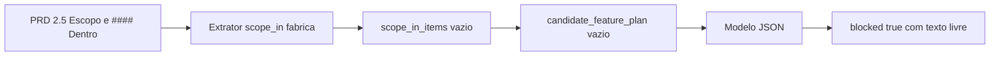

# Plano: corrigir bloqueio em `fabrica generate features` (ATIVOS-INGRESSOS)

## O que o erro significa

- O CLI imprime `Erro: Proposta bloqueada: ...` quando [`validate_lean_proposal`](c:\Users\NPBB\fabrica\scripts\fabrica_core\features_lean.py) recebe JSON com `blocked: true` e `blockers` não vazio ([`features_lean.py` ~751–752](c:\Users\NPBB\fabrica\scripts\fabrica_core\features_lean.py)).
- A string **"Projeto bloqueado devido a falta de recursos" não está no código**: é o modelo (OpenRouter, via [`prd_features_provider.py`](c:\Users\NPBB\fabrica\scripts\fabrica_core\prd_features_provider.py)) que escolhe o texto do bloqueio quando devolve `blocked=true`.
- O prompt obriga: se bloqueado → `features=[]`; se não bloqueado → `features` **não vazio** ([`prd_features_provider.py` ~40–42](c:\Users\NPBB\fabrica\scripts\fabrica_core\prd_features_provider.py)).

## Causa raiz provável no seu PRD

O bundle lean monta o contrato de cobertura a partir de subseções **Dentro** / **Fora** do escopo. Em [`prd_features_bundle.py`](c:\Users\NPBB\fabrica\scripts\fabrica_core\prd_features_bundle.py), `_SCOPE_CANDIDATES` só tenta:

- `## 5 Escopo` + `### Dentro` / `### Fora`
- `### 2.4 Escopo` + `### Dentro` / `### Fora` (mesmo nível 3 para o filho)

No [PRD em npbb](c:\Users\NPBB\npbb\PROJETOS\ATIVOS-INGRESSOS\PRD-ATIVOS-INGRESSOS.md) o escopo está como:

- `### 2.5 Escopo`
- `#### Dentro` / `#### Fora`

Nenhum candidato bate: [`_heading_exists`](c:\Users\NPBB\fabrica\scripts\fabrica_core\prd_features_bundle.py) falha para `2.4 Escopo` / `5 Escopo`, e [`extract_section`](c:\Users\NPBB\fabrica\scripts\fabrica_core\markdown.py) para `Dentro` com nível 3 não encontra `### Dentro` (só existe `#### Dentro`).

Efeito em cadeia:

1. [`_build_coverage_contract`](c:\Users\NPBB\fabrica\scripts\fabrica_core\prd_features_bundle.py) fica com `scope_in_items` **vazio**.
2. [`build_candidate_feature_plan`](c:\Users\NPBB\fabrica\scripts\fabrica_core\prd_features_bundle.py) retorna **lista vazia** quando não há itens (`if not items: return []`).
3. O modelo recebe `candidate_feature_plan: []` e, ao mesmo tempo, deve produzir `len(candidate_feature_plan)` features — ou seja, **0 features** — o que **conflita** com `blocked=false` (que exige `features` não vazio). A saída “segura” para o modelo é `blocked=true` com um bloqueio inventado (ex.: “falta de recursos”).



## Como confirmar (somente leitura / diagnóstico)

Rodar a partir de `C:\Users\NPBB\fabrica`:

```text
python .\scripts\fabrica.py --repo-root C:\Users\NPBB\npbb generate features --project ATIVOS-INGRESSOS --bundle-only
```

Inspecionar no JSON: `coverage_contract.scope_in_items` e `candidate_feature_plan`. Se ambos estiverem vazios, o diagnóstico acima está fechado.

## Caminhos de correção (escolha uma)

### Opção A — Ajustar a **fábrica** (recomendado, robusto)

Em [`prd_features_bundle.py`](c:\Users\NPBB\fabrica\scripts\fabrica_core\prd_features_bundle.py), estender `_SCOPE_CANDIDATES` para aceitar, por exemplo:

- `parent_heading`: `2.5 Escopo`, `parent_level`: 3  
- `child_heading`: `Dentro` / `Fora`, `child_level`: **4** (para casar com `#### Dentro` / `#### Fora`)

Isso reutiliza [`extract_section(..., level=4)`](c:\Users\NPBB\fabrica\scripts\fabrica_core\markdown.py), que já para no próximo `#### `.

Incluir teste em [`tests/`](c:\Users\NPBB\fabrica\tests) com um PRD mínimo no mesmo formato (2.5 Escopo + #### Dentro).

### Opção B — Ajustar só o **PRD** (npbb)

Alinhar títulos ao que a fábrica já entende: passar a usar `### 2.4 Escopo` (ou `## 5 Escopo`) e **`### Dentro` / `### Fora`** (nível 3), não `####`.

**Cuidado:** trocar só `#### Dentro` por `### Dentro` **sem** reorganizar o restante pode fazer o `extract_section` nível 3 “engolir” o bloco até o próximo `### `, incluindo **Fora**, se a estrutura não for a que o extrator pressupõe. Por isso a opção A costuma ser mais segura.

### Opção C — Contornar o provider

- `--proposal-file` com JSON válido já validado, ou
- gerar bundle com `--bundle-only`, editar/gerar proposta manualmente.

Não remove a causa do `candidate_feature_plan` vazio para próximas execuções automáticas.

## Outros bloqueios a ter em mente

- Pastas `PROJETOS/ATIVOS-INGRESSOS/features/FEATURE-*` existentes disparam erro **antes** do provider ([`preflight_lean_prd_to_features`](c:\Users\NPBB\fabrica\scripts\fabrica_core\features_lean.py) ~173–177). O seu caso atual passou do preflight e falhou na proposta — coerente com escopo não extraído, não com pastas antigas (verifique se no disco ainda há `FEATURE-*` se o erro mudar).

## Resumo

| Onde | O quê |
|------|--------|
| Causa | Formato de headings do escopo no PRD não reconhecido pelo extrator lean → plano de features vazio → modelo devolve `blocked=true`. |
| Texto do erro | Livre do modelo; não indica API key nem “recursos” de infra de forma confiável. |
| Correção principal | Alinhar extrator (opção A) ou headings do PRD (opção B). |
