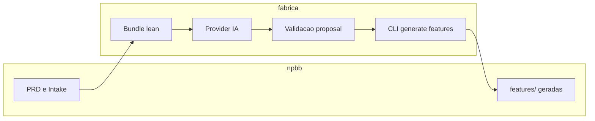

# Guia a partir do [PLAN1.md](c:\Users\NPBB\npbb\PLAN1.md)

## O que o arquivo já diz (estado)

- **Intake**: [INTAKE-ATIVOS-INGRESSOS.md](c:\Users\NPBB\npbb\PROJETOS\ATIVOS-INGRESSOS\INTAKE-ATIVOS-INGRESSOS.md) com `status: approved` e `last_updated: 2026-04-04` — alinhado ao handoff.
- **PRD**: Reestruturado para o template canónico v3; headings críticos devem permanecer **exatamente** como o extrator lean espera (incluindo `## 5 Riscos Globais`, `## 8 Rollout e Comunicacao`, `### 2.4 Escopo` com `### Dentro` / `### Fora`) — ver aviso nas linhas 31–34 do PLAN1.
- **Bundle-only**: `generate features --bundle-only` com `--repo-root` no npbb já produz metadata e `prd_evidence` coerentes no bundle lean.
- **Bloqueio atual**: sem `--bundle-only`, o fluxo com IA falha com **"prd_evidence deve conter pelo menos 1 item"** porque a resposta real inclui drift típico: `prd_evidence` como **string** (não lista de objetos), `behavior_expected` ausente ou não-lista; mitigações já feitas no CLI cobrem `project`/`prd_path` e `feature_slug`, mas **não** esses campos (de propósito, por risco semântico).

**Nota de workspace**: a lógica citada (`prd_features_provider.py`, `features_lean.py`, `cli.py`) vive no repo **`C:\Users\NPBB\fabrica`**, não no npbb (não há `prd_features_provider.py` no npbb). O restante do PLAN1 é sobretudo log de comandos e dumps.

## Próximos passos (ordem sugerida)

### 1. Congelar o PRD no npbb (revisão humana curta)

- Reabrir [PRD-ATIVOS-INGRESSOS.md](c:\Users\NPBB\npbb\PROJETOS\ATIVOS-INGRESSOS\PRD-ATIVOS-INGRESSOS.md) só para confirmar que os títulos sensíveis ao extrator não foram alterados e que o conteúdo ainda reflete o intake.
- Se estiver ok, trate o PRD como **fonte estável** enquanto ajusta o provider.

### 2. No repositório fabrica: fechar o contrato modelo ↔ validador

Objetivo: `python .\scripts\fabrica.py --repo-root C:\Users\NPBB\npbb generate features --project ATIVOS-INGRESSOS` **completar** sem erro.

Duas linhas de ataque (o PLAN1 sugere escolher ou combinar):

| Abordagem | O que fazer |
|-----------|-------------|
| **Prompt / schema** | Reforçar instruções e exemplos no provider para que **cada feature** traga `prd_evidence` como **lista** de evidências estruturadas (e `behavior_expected` como **lista** de strings ou o tipo que o validador exige). Menos “magia” no CLI. |
| **Normalização no CLI** | Estender `_hydrate_provider_payload` (ou camada equivalente) para corrigir drift **seguro** (ex.: string única → lista com um item; string em `behavior_expected` → lista de um elemento), com testes em [test_fabrica_cli.py](https://github.com/) / `test_prd_features_provider.py` no fabrica. Só onde a conversão for semanticamente inequívoca. |

O experimento no PLAN1 (por volta da linha 6132) mostra que a hidratação atual **preserva** `prd_evidence` e `behavior_expected` como string — ou seja, o próximo passo é ou **mudar o modelo** ou **validar/normalizar antes** da regra “pelo menos 1 item”.

### 3. Rodar o pipeline real e regenerar `features/` no npbb

- Após o fix no fabrica: executar `generate features` **sem** `--bundle-only` apontando para o npbb.
- Conferir se `PROJETOS/ATIVOS-INGRESSOS/features/` fica completa e consistente com [GOV-FEATURE](c:\Users\NPBB\npbb\PROJETOS\COMUM\GOV-FEATURE.md) / layout canónico.

### 4. Git e pastas: alinhar estado local

- O git status do handoff mostra **deleções** das FEATURE-1…8 antigas e, no disco, havia/pode haver pastas novas parciais (hoje o workspace já tem [FEATURE-1-CONFIGURACAO-POR-EVENTO](c:\Users\NPBB\npbb\PROJETOS\ATIVOS-INGRESSOS\features\FEATURE-1-CONFIGURACAO-POR-EVENTO) e [FEATURE-2-RECONCILIACAO-QUANTIDADE](c:\Users\NPBB\npbb\PROJETOS\ATIVOS-INGRESSOS\features\FEATURE-2-RECONCILIACAO-QUANTIDADE)).
- Depois de uma geração bem-sucedida: **revisar diff** e fazer um commit que reflita só o conjunto final de features (evitar reset cego — aviso do próprio PLAN1).

### 5. Cuidados operacionais (Windows)

- Não rodar dois `pytest` em paralelo no fabrica se compartilharem `.tmp-pytest` (conflito mencionado no PLAN1).
- Garantir `OPENROUTER_API_KEY` (e modelo, se usar `FABRICA_FEATURES_PROVIDER_MODEL`) carregados conforme o README do fabrica para `--repo-root` no npbb.

## Critério de “pronto”

- Comando completo `generate features` para `ATIVOS-INGRESSOS` no npbb termina com sucesso e materializa/atualiza as FEATUREs esperadas, com `prd_evidence` e `behavior_expected` aceitos pelo validador.
- Testes do fabrica continuam passando (incluindo regressão para os casos de hidratação de slug e payload mínimo).
