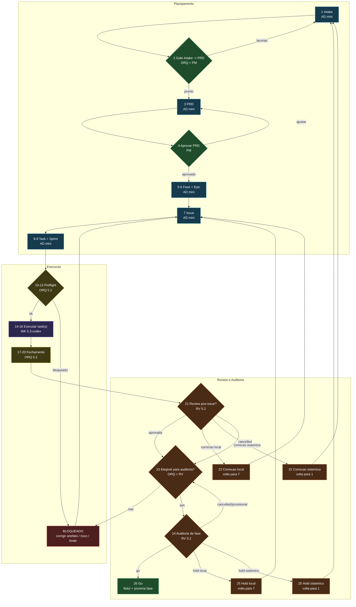

# Fluxo Enxuto do Algoritmo

## Legenda de Agentes

- `AD mini`: analista documental com `gpt-5.4-mini`
- `ORQ 5.2`: orquestrador de governanca com `gpt-5.2`
- `WK 5.3-codex`: worker de implementacao com `gpt-5.3-codex`
- `RV 5.2`: reviewer/auditor com `gpt-5.2`
- `PM`: aprovacao humana

## Politica de Modelos

- `gpt-5.4-mini`: intake, PRD, fase, epic, issue, task e sprint. Melhor custo/qualidade para transformacao documental e checagem de aderencia.
- `gpt-5.2`: preflight, risco, gate, work order, review e auditoria padrao. Melhor equilibrio para governanca e decisao.
- `gpt-5.3-codex`: implementacao de codigo como default.
- `gpt-5.4`: usar so por escalada, quando houver `R2/R3`, migration/rollback delicado, refatoracao sistemica, auditoria ambigua ou conflito de evidencias.

## Regra de Escalada

- subir de `mini` para `5.2` quando a tarefa deixar de ser documental e passar a exigir julgamento
- subir de `5.2` para `5.4` quando risco e ambiguidade forem altos
- nao usar modelo caro para tarefa mecanica
- nao usar modelo barato para tarefa que pode errar a governanca ou a arquitetura
