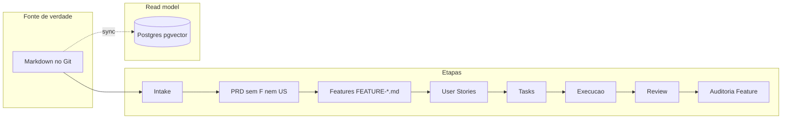

# SPEC — Migração do pipeline: PRD sem Features/User Stories

> Alias normativo: **SPEC: Pipeline com PRD sem Features nem User Stories** — especificação de migração do framework (problema, arquitetura alvo, impacto, estratégia, compatibilidade, aceite).

## 1. Problema atual (baseline)

Historico capturado em detalhe em [`LEGADO/SPEC-T1-ESTADO-ATUAL-FRAMEWORK-OPENCLAW.md`](LEGADO/SPEC-T1-ESTADO-ATUAL-FRAMEWORK-OPENCLAW.md) (baseline pre-migracao documental):

- O **PRD** era tratado como lugar de **catalogo de Features** e, no template/prompts, **User Stories planejadas** no mesmo ficheiro.
- A **decomposicao pos-PRD** concentrava-se em **uma sessao monolitica** (`SESSION-PLANEJAR-PROJETO`) para Features, US e Tasks.
- O **indice operacional** materializava-se em **SQLite** (v4), sem `execution_commits` / `sync_runs` nem `pgvector`.

Isso misturava **contrato estrategico do produto** (PRD) com **backlog entregavel** (features, US, tasks), dificultando gates claros e integracao semantica com memoria do agente.

## 2. Arquitetura alvo

### 2.1 Pipeline normativo

```text
Intake -> PRD -> Features -> User Stories -> Tasks -> Execucao -> Review -> Auditoria de Feature
```

- **PRD:** apenas problema, objetivo, escopo, restricoes, riscos, metricas, arquitetura geral, rollout e rastreabilidade ao intake — **sem** listar Features nem User Stories (`GOV-PRD.md`, `TEMPLATE-PRD.md`).
- **Features:** manifestos versionados `features/FEATURE-<N>-<SLUG>/FEATURE-<N>.md` (`GOV-FEATURE.md`, `TEMPLATE-FEATURE.md`).
- **User Stories / Tasks:** pastas canonicas sob cada feature; etapas explicitas com prompts e sessoes dedicadas.



### 2.2 Etapas explicitas de decomposicao

| Etapa | Prompt canonico | Sessao |
|-------|-----------------|--------|
| PRD -> Features | `PROMPT-PRD-PARA-FEATURES.md` | `SESSION-DECOMPOR-PRD-EM-FEATURES.md` |
| Feature -> User Stories | `PROMPT-FEATURE-PARA-USER-STORIES.md` | `SESSION-DECOMPOR-FEATURE-EM-US.md` |
| User Story -> Tasks | `PROMPT-US-PARA-TASKS.md` | `SESSION-DECOMPOR-US-EM-TASKS.md` |

### 2.3 Fonte de verdade e read model

- **Markdown + Git** permanecem **unica autoridade** para criacao e edicao de artefatos de governanca.
- **Postgres** (com `pgvector`) e o **read model operacional alvo** para consulta, FTS complementar, embeddings e ligacao a memoria maior do agente — ver [`SPEC-INDICE-PROJETOS-POSTGRES.md`](SPEC-INDICE-PROJETOS-POSTGRES.md).

### 2.4 Router legado

- `SESSION-PLANEJAR-PROJETO.md` mantem-se como **roteador de compatibilidade**, apontando para as sessoes e prompts acima; **nao** reintroduz catalogo de Features no PRD.

## 3. Impacto

| Area | Impacto |
|------|---------|
| **Autores de PRD** | Deixam de preencher seccoes de backlog de Features/US no PRD; passam a usar a etapa `PRD -> Features`. |
| **PM / agentes** | Planejamento em **tres sessoes** (ou router) em vez de um unico bloco monolitico. |
| **Skills e automacao** | Referencias a «PRD com features» ou «SESSION-PLANEJAR como unica decomposicao» devem ser atualizadas. |
| **Projetos existentes** | PRDs historicos com Features/US no corpo **nao** invalidam o repo; novos PRDs seguem `GOV-PRD.md`. Migracao de conteudo legado e opcional por projeto. |
| **Indice** | Cutover operacional concluido em Postgres; SQLite fica restrito a migracao/backfill explicitos documentados em `SPEC-INDICE-PROJETOS-POSTGRES.md` e `scripts/fabrica_projects_index/README.md`. |

## 4. Estrategia de migracao

1. **Norma primeiro:** publicar `GOV-PRD.md`, `GOV-FEATURE.md`, revisar `TEMPLATE-PRD.md`, prompts intake/PRD, `SESSION-CRIAR-PRD.md`, `SESSION-MAPA.md`, `GOV-FRAMEWORK-MASTER.md`, `AGENTS.md`, `boot-prompt.md`.
2. **Sessoes e prompts:** garantir `SESSION-DECOMPOR-*` e `PROMPT-*-PARA-*` para cada salto do pipeline.
3. **Router:** transformar `SESSION-PLANEJAR-PROJETO.md` em wrapper que encaminha sem duplicar algoritmo monolitico.
4. **Indice:** manter o runtime operacional em Postgres e limitar SQLite a ferramentas explicitas de migracao/backfill, sem expor backend legado como fluxo normal de operador.
5. **Corpus legado:** projetos com PRD antigo podem ser higienizados em PRs dedicados ou tolerados ate proxima revisao de PRD.

## 5. Compatibilidade

- **Layout de pastas** `features/FEATURE-*/user-stories/...` **inalterado** (`GOV-FRAMEWORK-MASTER.md`).
- **Gates** `GOV-SCRUM.md`, `GOV-USER-STORY.md`, `GOV-AUDITORIA-FEATURE.md` permanecem validos apos existirem artefatos.
- **Skills e docs operacionais** devem tratar Postgres como read model obrigatorio; referencias a SQLite ficam confinadas a migracao/backfill explicitos.
- Nenhum documento ativo deve **exigir** que o PRD liste Features ou User Stories.

## 6. Criterios de aceite

- [x] Nenhum ficheiro normativo ativo em `PROJETOS/COMUM/` obriga catalogo de Features ou US **dentro** do PRD.
- [x] Existem prompts canonicos explicitos para `PRD -> Features`, `Feature -> User Stories` e `User Story -> Tasks`.
- [x] Existem sessoes `SESSION-DECOMPOR-*` correspondentes (ou router documentado) para cada salto.
- [x] Entrypoints (`AGENTS.md`, `SESSION-MAPA.md`, `boot-prompt.md`, `GOV-FRAMEWORK-MASTER.md`) declaram a cadeia completa e o PRD sem backlog estruturado.
- [x] O framework declara **Postgres** como read model alvo (spec + README do indice); Markdown permanece fonte de verdade.
- [x] SPEC Postgres cobre tabelas obrigatorias incl. `execution_commits` e `sync_runs`.
- [x] DDL Postgres base (`schema_postgres.sql`) e espelho opcional SQLite -> Postgres (`legacy/mirror_sqlite_to_postgres.py`) publicados em `scripts/fabrica_projects_index/`.

## 7. Riscos e mitigacao

| Risco | Mitigação |
|-------|-----------|
| Agentes gerarem PRD com catalogo de features por hábito | `GOV-PRD`, `TEMPLATE-PRD`, `SESSION-CRIAR-PRD` e prompts intake com stop explícito. |
| Projeto sem `features/` após PRD | `boot-prompt` em `BLOQUEADO` até `SESSION-DECOMPOR-PRD-EM-FEATURES`. |
| Drift entre PRD legado e manifestos | Manifesto `FEATURE-*.md` e US em `features/` são fonte para execução; PRD só contexto estratégico. |
| Drift documental do indice | README, specs e skills devem ensinar apenas Postgres como superficie operacional; SQLite fica isolado em secoes legadas de migracao/backfill. |

## 8. Documentos relacionados

- [`LEGADO/SPEC-T1-ESTADO-ATUAL-FRAMEWORK-OPENCLAW.md`](LEGADO/SPEC-T1-ESTADO-ATUAL-FRAMEWORK-OPENCLAW.md) — baseline historico pre-migracao.
- [`SPEC-INDICE-PROJETOS-POSTGRES.md`](SPEC-INDICE-PROJETOS-POSTGRES.md) — contrato tecnico do read model.
- [`schema_postgres.sql`](../../scripts/fabrica_projects_index/schema_postgres.sql) — DDL Postgres bundle `pg-1`.
- [`scripts/fabrica_projects_index/README.md`](../../scripts/fabrica_projects_index/README.md) — runtime operacional Postgres e fluxos legados de migracao/backfill.
- [`GOV-FRAMEWORK-MASTER.md`](GOV-FRAMEWORK-MASTER.md) — mapa mestre do repositorio.
