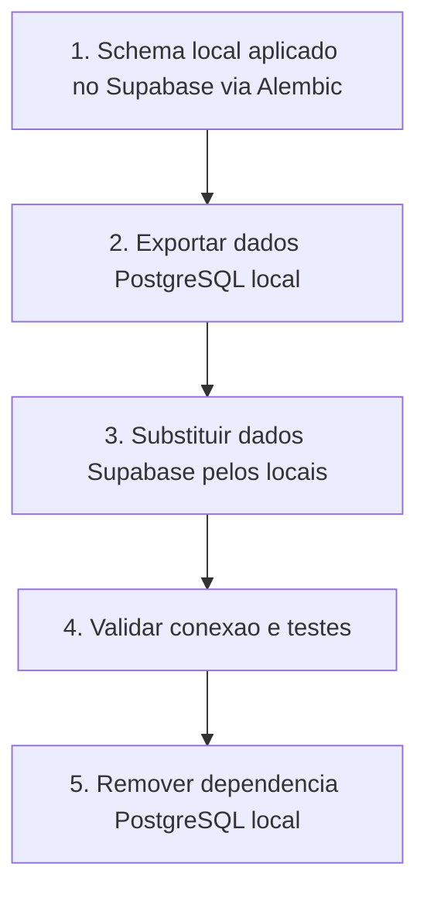

# PRD — Migração PostgreSQL Local → Supabase

> **Origem:** [INTAKE-SUPABASE.md](./INTAKE-SUPABASE.md)

---

## 1. Visão e Objetivo

**Tese:** Supabase como única fonte de banco de dados, refletindo o estado atual do código e dados locais.

**Valor esperado:**
- Deploy unificado (Render + Supabase + Cloudflare) desbloqueado
- Ambiente unificado; PostgreSQL local removido completamente
- Schema e dados migrados; Supabase substituído pelo estado do PostgreSQL local

---

## 2. Fluxo Principal

1. Garantir que o schema local seja aplicado no Supabase (migrations Alembic)
2. Exportar dados do PostgreSQL local (pg_dump ou ferramenta adequada)
3. Substituir dados do Supabase pelos dados locais (import, truncate + reload conforme estratégia)
4. Validar: backend conectando ao Supabase; testes passando; dados consistentes
5. Remover dependência do PostgreSQL local; configurar DATABASE_URL/DIRECT_URL para Supabase

---

## 3. Escopo

### Dentro do escopo

- Migrations Alembic aplicadas no Supabase
- Migração de dados (schema + dados) do PostgreSQL local para Supabase
- Configuração DATABASE_URL (pooler :6543) e DIRECT_URL (direct :5432)
- Validação de conexão e testes
- Remoção da dependência do PostgreSQL local

### Fora do escopo

- Integração com Supabase Auth (manter auth própria do backend: JWT/SECRET_KEY)
- Mudanças de modelo de dados além do merge
- Alterações no frontend

---

## 4. Respostas às Perguntas do Intake

| Pergunta | Resposta |
|----------|----------|
| **Estratégia de export/import?** | `pg_dump --data-only` (ou `--format=custom`) após schema aplicado; import com `psql` ou `pg_restore`; ordem respeitando FKs (truncate em ordem reversa de dependência antes de reload). Detalhes de ordem de tabelas e FKs serão especificados na fase F2. |
| **Schema primeiro ou schema+dados juntos?** | **Schema primeiro**: `alembic upgrade head` no Supabase; depois import de dados. |
| **Rollback?** | Backup do Supabase antes da migração; restore via Supabase Dashboard ou `pg_restore`; manter dump local como cópia de segurança até validação completa. |

---

## 5. Arquitetura Afetada

| Componente | Impacto |
|------------|---------|
| **Backend** | `backend/app/db/database.py`, variáveis de ambiente |
| **Alembic** | `backend/alembic/env.py` — já suporta Supabase (DIRECT_URL preferido para migrations) |
| **Config** | `backend/.env`, `backend/.env.example`, `docs/SETUP.md`, `docs/DEPLOY_RENDER_CLOUDFLARE.md` |
| **Frontend** | Não altera |
| **Banco/migrations** | Principal; ~49 migrations Alembic em `backend/alembic/versions/` |

---

## 6. Fases

| Fase | Nome | Objetivo | Status |
|------|------|----------|--------|
| F1 | Schema no Supabase | Aplicar migrations Alembic no Supabase; validar que `alembic upgrade head` funciona com DIRECT_URL | todo |
| F2 | Migração de Dados | Script/processo de export (pg_dump) e import; substituir dados do Supabase pelos locais | todo |
| F3 | Validação e Cutover | Backend conectando ao Supabase; testes passando; configurar .env para Supabase; remover dependência PostgreSQL local | todo |

---

## 7. Requisitos Funcionais

| ID | Requisito | Fase | Prioridade |
|----|------------|------|------------|
| RF-01 | Schema aplicado no Supabase via `alembic upgrade head` com DIRECT_URL | F1 | Must |
| RF-02 | Export de dados do PostgreSQL local (pg_dump ou equivalente) | F2 | Must |
| RF-03 | Import de dados no Supabase (substituindo dados existentes) | F2 | Must |
| RF-04 | Backend conectando ao Supabase em ambiente de validação | F3 | Must |
| RF-05 | DATABASE_URL e DIRECT_URL configurados para Supabase; PostgreSQL local removido | F3 | Must |

---

## 8. Requisitos Não-Funcionais

| ID | Requisito | Meta |
|----|------------|------|
| NF-01 | Testes com `TESTING=true` continuam usando SQLite | Sem regressão na CI |
| NF-02 | DATABASE_URL (pooler :6543) e DIRECT_URL (direct :5432) documentados | `.env.example` e `docs/SETUP.md` atualizados |
| NF-03 | Compatibilidade com Alembic preservada | Migrations aplicam sem alteração |
| NF-04 | Auth própria do backend (JWT/SECRET_KEY) mantida | Não integrar Supabase Auth |

---

## 9. Restrições

- Preservar compatibilidade com Alembic
- Não quebrar testes com SQLite (`TESTING=true`)
- Manter auth própria do backend (JWT/SECRET_KEY); não integrar Supabase Auth

---

## 10. Riscos e Mitigação

| Risco | Mitigação |
|-------|-----------|
| Conflito de schema / migrations em ordem diferente | Usar `alembic upgrade head` — ordem já definida no histórico |
| Downtime durante migração | Migração pode ser feita em janela de manutenção; Supabase pode ser substituído |
| Perda de dados | Dados locais são fonte; backup do Supabase antes de substituir |

---

## 11. Rollback

- Backup do Supabase (Dashboard ou `pg_dump`) antes da migração
- Restore via Supabase Dashboard ou `pg_restore` em caso de falha
- Manter dump local como cópia de segurança até validação completa

---

## 12. Definition of Done

- [ ] Schema aplicado no Supabase via Alembic
- [ ] Dados locais importados no Supabase
- [ ] Backend conectando ao Supabase em ambiente de validação
- [ ] Testes passando (CI verde)
- [ ] Documentação (.env.example, SETUP.md) atualizada para Supabase
- [ ] PostgreSQL local não mais necessário para desenvolvimento

---

## 13. Não-Objetivos

- Integrar Supabase Auth
- Refatorar modelos de dados
- Alterar frontend
- Mudar estratégia de deploy além do banco

---

## 14. Hipóteses Declaradas

1. **Estratégia de dados**: `pg_dump --data-only` + import via `psql` ou `pg_restore` — detalhes de ordem de tabelas e FKs serão especificados na fase F2
2. **Ordem**: schema primeiro (Alembic), depois dados
3. **Rollback**: backup Supabase + restore; manter dump local até validação

---

## 15. Referências

- **Intake:** [INTAKE-SUPABASE.md](./INTAKE-SUPABASE.md)
- **Código:** `backend/alembic/`, `backend/app/db/database.py`
- **Deploy:** [docs/DEPLOY_RENDER_CLOUDFLARE.md](../../docs/DEPLOY_RENDER_CLOUDFLARE.md)
