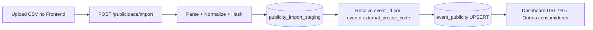
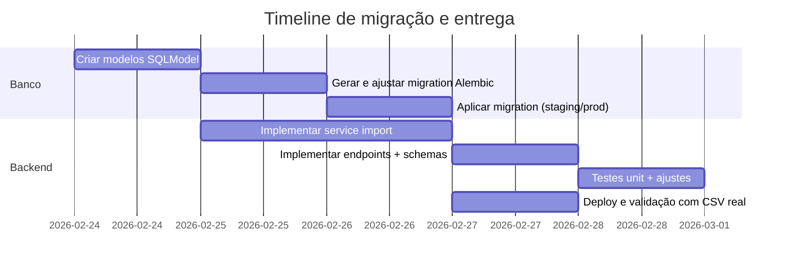

# Deep research: localizar o CRUD no repositório e implementar mudanças no banco para atender o PRD

## Resumo executivo

O repositório que atende ao contexto do PRD é **`davidcantidio/npbb`** (privado) e a stack **não é Next.js/Nest/Express/Rails/Django/Laravel**: é **Backend em FastAPI + SQLModel + Alembic** e **Frontend em React/Vite**, com banco **Postgres no Supabase** acessado via **SQLAlchemy/psycopg2**. fileciteturn46file0L1-L1 fileciteturn47file1L1-L1

Para atender o PRD de publicidade (import CSV → staging → upsert final → consumo por dashboards/BI), a implementação recomendada é:

- **Banco (DDL via Alembic ou SQL)**: criar `publicity_import_staging` + `event_publicity`, índices/constraints de idempotência e um mecanismo confiável de `updated_at`; adicionar `external_project_code` em `evento` para resolver `event_id`.
- **CRUD (FastAPI)**: criar um novo módulo/rota de import no backend seguindo o padrão já usado para import de leads (preview/validate/import), com **hash por linha**, **ingestão idempotente em staging** e **UPSERT** na tabela final usando `INSERT ... ON CONFLICT DO UPDATE` (UPSERT) do Postgres. citeturn0search2
- **Operação**: migrations e deploy com passos claros; segurança focada em chaves/roles e (se houver consumo direto do Supabase Data API pelo frontend) considerar RLS/policies. citeturn0search0

Onde eu não consigo inferir com certeza sem abrir arquivos específicos (ex.: como o `Session` é injetado no FastAPI e como o `app.main` registra routers), marquei como **“não especificado”** e deixei comandos objetivos para o Codex/dev confirmar rapidamente no repo.

## Constatações do repositório e conectores

Conectores habilitados: **GitHub**.

Repositório alvo: **`davidcantidio/npbb`** (encontrado no escopo do GitHub conectado). fileciteturn46file0L1-L1

Stack declarada/documentada no repo:

- Backend: FastAPI + SQLModel; migrations com Alembic. fileciteturn46file0L1-L1 fileciteturn47file2L1-L1
- Frontend: React + Vite; chama API do backend (não “direto no Supabase” por padrão). fileciteturn47file1L1-L1
- Banco: Postgres no Supabase; variáveis importantes `DATABASE_URL` e `DIRECT_URL` (migrations preferem conexão direta). fileciteturn47file0L1-L1 fileciteturn47file2L1-L1
- Estrutura do backend (padrão do repo): `backend/app/{models,schemas,routers,services,utils,db,core}`. fileciteturn47file1L1-L1

Frameworks “comuns” solicitados:
- Next.js: **não especificado / não indicado** no repo. fileciteturn46file0L1-L1
- NestJS: **não especificado / não indicado**.
- Express: **não especificado / não indicado**.
- Rails: **não especificado / não indicado**.
- Django: **não especificado / não indicado**.
- Laravel: **não especificado / não indicado**.

## Como localizar o CRUD que alimenta o Supabase no repo

A regra simples: **o CRUD que “alimenta o Supabase” é o CRUD que grava no Postgres via SQLAlchemy/SQLModel**.

### Mapas de onde olhar primeiro

1) **Modelos (tabelas)**
- `backend/app/models/models.py` é o arquivo central de modelos SQLModel (inclui `Evento` com `__tablename__ = "evento"`). fileciteturn30file6L1-L1

2) **Schemas (contratos Pydantic)**
- Eventos: `backend/app/schemas/evento.py` (Create/Update/Read/ListItem). fileciteturn30file0L1-L1

3) **Routers (endpoints)**
- Existem routers para eventos/leads/etc. (ex.: `backend/app/routers/eventos.py`, `backend/app/routers/leads.py`). fileciteturn33file6L1-L1 fileciteturn33file10L1-L1

4) **Migrations**
- Alembic em `backend/alembic/` e revisões em `backend/alembic/versions/`. fileciteturn47file2L1-L1 fileciteturn44file1L1-L1

5) **Config de migrations e conexão**
- `backend/alembic/env.py` documenta por que usar `DIRECT_URL` no Supabase para migrations. fileciteturn47file2L1-L1

### Comandos “cirúrgicos” que o Codex/dev deve rodar no repo

> Se algum item na seção seguinte ficar “não especificado”, rode isso e preencha.

```bash
# na raiz do repo
rg -n "SQLModel|__tablename__|class Evento" backend/app/models
rg -n "APIRouter|router\\s*=|@router\\." backend/app/routers
rg -n "get_db|Session\\(|Depends\\(" backend/app
rg -n "alembic\\s+upgrade|revision\\s+--autogenerate|DIRECT_URL|DATABASE_URL" backend
rg -n "import/preview|POST /leads/import|/leads/import" docs backend frontend
```

Por que isso funciona:
- O repo tem padrão explícito de separação `models/schemas/routers/services` (logo você encontra o CRUD sem caça ao tesouro). fileciteturn47file1L1-L1
- As migrations estão formalizadas via Alembic (`alembic upgrade head` faz parte do setup). fileciteturn47file0L1-L1
- O pipeline de import de leads já existe e documenta o padrão de rotas (serve de “molde” para publicidade). fileciteturn51file0L1-L1

## Mapa de modelos/tabelas e migrations existentes

### Tabelas-base relevantes (já existentes)

Pelos modelos SQLModel, o sistema tem (entre outras):
- `evento` (tabela dos eventos; **não é `events`**).
- `usuario`, `agencia`, `diretoria`, `funcionario`, `status_evento`.
- `lead` e tabelas relacionadas (import e dashboards já existem). fileciteturn30file6L1-L1

### Implicação direta para o PRD

O PRD pede vínculo `event_publicity.event_id → events.id`. No repo, o “evento” está em `evento.id`, então o correto é:

- `event_publicity.event_id` **FK para** `evento.id`
- Precisamos adicionar em `evento` um campo de “ponte” para o CSV: `external_project_code` (mapeia `CodigoProjeto` → evento). fileciteturn30file6L1-L1

### Migrations existentes e padrão de execução

- As migrations são geridas por Alembic (`backend/alembic`) e o setup recomenda `alembic upgrade head`. fileciteturn47file0L1-L1
- O `env.py` do Alembic deixa claro que migrations em Supabase devem usar **conexão direta** (`DIRECT_URL`) porque poolers podem causar bloqueios/timeout em alguns ambientes. fileciteturn47file2L1-L1
- Quando usar autogenerate, Alembic compara o estado do banco (pela URL) com o metadata dos modelos e gera diffs “óbvios”, mas o dev deve revisar e ajustar. citeturn1search2

## Mudanças no banco para suportar publicidade

A seguir, **SQL pronto para Postgres/Supabase** (DDL). Você pode aplicar via Alembic (`op.execute`) ou via SQL Editor do Supabase (em staging primeiro).

### Tabela staging e tabela final

**Objetivo técnico**:
- `publicity_import_staging`: trilha de auditoria + idempotência por arquivo/linha.
- `event_publicity`: tabela final de consumo por dashboard/BI; dedupe por chave natural.

**DDL (Postgres)**

```sql
-- 1) função de updated_at (opcional, mas deixa a vida menos triste)
create or replace function public.set_updated_at()
returns trigger as $$
begin
  new.updated_at = now();
  return new;
end;
$$ language plpgsql;

-- 2) staging
create table if not exists public.publicity_import_staging (
  id bigint generated by default as identity primary key,
  source_file text not null,
  source_row_hash text not null,
  imported_at timestamptz not null default now(),

  codigo_projeto text not null,
  projeto text not null,
  data_vinculacao date not null,
  meio text not null,
  veiculo text not null,
  uf text not null,
  uf_extenso text not null,
  municipio text null,
  camada text not null,

  normalized jsonb null
);

create unique index if not exists ux_publicity_import_staging_file_hash
on public.publicity_import_staging (source_file, source_row_hash);

-- 3) tabela final
create table if not exists public.event_publicity (
  id bigint generated by default as identity primary key,

  event_id bigint null references public.evento(id) on delete set null,

  publicity_project_code text not null,
  publicity_project_name text not null,
  linked_at date not null,

  medium text not null,
  vehicle text not null,

  uf text not null,
  uf_name text null,
  municipality text null,

  layer text not null,

  source_file text null,
  source_row_hash text null,

  created_at timestamptz not null default now(),
  updated_at timestamptz not null default now()
);

-- dedupe lógico pro UPSERT
create unique index if not exists ux_event_publicity_natural_key
on public.event_publicity (
  publicity_project_code, linked_at, medium, vehicle, uf, layer
);

create index if not exists ix_event_publicity_linked_at
on public.event_publicity (linked_at);

create index if not exists ix_event_publicity_event_id
on public.event_publicity (event_id);

-- trigger updated_at
drop trigger if exists trg_event_publicity_updated_at on public.event_publicity;
create trigger trg_event_publicity_updated_at
before update on public.event_publicity
for each row execute function public.set_updated_at();
```

**Por que UPSERT depende do índice unique**: `INSERT ... ON CONFLICT DO UPDATE` precisa de um alvo de conflito com constraint/índice único (ou inferência), senão a operação não tem “chave” para escolher o que atualizar. citeturn0search2

### Coluna de ponte no evento

```sql
alter table public.evento
add column if not exists external_project_code text null;

create unique index if not exists ux_evento_external_project_code
on public.evento (external_project_code)
where external_project_code is not null;
```

### RLS e policies (se aplicável)

Se vocês expõem tabelas via Supabase Data API diretamente para browser (não aparenta ser o padrão aqui), **RLS vira obrigatório** em schemas expostos (por padrão `public`), e sem policies **não há acesso** via `anon key`. citeturn0search0

Recomendação pragmática:
- Se o consumo é **via backend** (API FastAPI), mantenha acesso por role do backend e trate RLS como “defesa extra”.
- Se o consumo é **via browser** (supabase-js), habilite RLS em `event_publicity` e crie policies de SELECT mínimas e explícitas. citeturn0search0

## Alterações no código do CRUD

### O que criar/alterar no backend

O padrão do repo sugere esta organização (models/schemas/routers/services/utils). fileciteturn47file1L1-L1

#### Modelos (SQLModel)

Adicionar em `backend/app/models/models.py`:
- `PublicityImportStaging` (`__tablename__="publicity_import_staging"`)
- `EventPublicity` (`__tablename__="event_publicity"`)

Alterar `Evento`:
- adicionar `external_project_code: Optional[str] = Field(default=None, max_length=...)`

> **Nota**: o repo usa `__tablename__="evento"`; respeite isso ao criar FK. fileciteturn30file6L1-L1

#### Schemas (Pydantic)

Criar `backend/app/schemas/publicidade.py` com:
- `PublicityImportReport` (contadores + erros por linha)
- `EventPublicityRead` (para listar no dashboard)
- (opcional) `PublicityImportPreview` e `PublicityImportValidateRequest` se adotar preview/validate igual ao leads

Alterar `backend/app/schemas/evento.py`:
- incluir `external_project_code` em `EventoRead` e `EventoUpdate` (opcional no payload). fileciteturn30file0L1-L1

#### Service (regras)

Criar `backend/app/services/publicidade_import.py` com pipeline:

1) **Parse** (CSV; opcional XLSX)
2) **Normalize** (trim, caixa, datas)
3) **Hash por linha** (idempotência)
4) **Insert staging** com `ON CONFLICT DO NOTHING`
5) **Resolver `event_id`** via `evento.external_project_code == CodigoProjeto`
6) **UPSERT final** em `event_publicity` usando a chave natural

**UPSERT no Postgres (conceito/contrato)**: `INSERT ... ON CONFLICT DO UPDATE` é explicitamente suportado e documentado. citeturn0search2

#### Router (endpoints)

Criar `backend/app/routers/publicidade.py` e registrar no `app.main` (não especificado: arquivo exato de registro do router, confirmar via `rg "include_router"`).

Endpoints mínimos recomendados:
- `POST /publicidade/import` (multipart: arquivo CSV; `source_file` opcional; `dry_run` opcional)
- `GET /publicidade` (query: `date` ou `data_inicio/data_fim`, `uf`, `medium`, `event_id`)
- (opcional) `POST /publicidade/import/preview` e `POST /publicidade/import/validate` para UX igual ao leads

O repo já tem um padrão de import documentado para leads (preview/validate/import), o que é um bom template mental para publicidade. fileciteturn51file0L1-L1

### Parser CSV e idempotência

#### Contrato CSV (mínimo)

Header esperado (exatamente como a planilha de origem):
- `CodigoProjeto,Projeto,data_vinculacao,Meio,Veiculo,UF,UF_Extenso,Municipio,Camada`

Regras:
- obrigatórios: todos exceto `Municipio`
- `data_vinculacao`: coerção para `date`
- canonicalização/hash: usar campos do dedupe lógico

#### Hash por linha (canônico)

Sugestão (estável e simples):
- `canonical = "{CodigoProjeto}|{data_vinculacao}|{Meio}|{Veiculo}|{UF}|{Camada}"` (com normalização)
- `source_row_hash = sha256(canonical)`

#### UPSERT: lógica

- Staging: `ON CONFLICT (source_file, source_row_hash) DO NOTHING`
- Final: `ON CONFLICT (publicity_project_code, linked_at, medium, vehicle, uf, layer) DO UPDATE SET ...`

O Postgres documenta o comportamento e requisitos de privilégios/colunas em `INSERT ... ON CONFLICT`. citeturn0search2

### Exemplos de trechos de código

#### Hash e normalização (Python)

```py
import hashlib
from datetime import date
from typing import Any

def norm_text(v: Any) -> str:
    return str(v or "").strip().replace("\u00a0", " ")

def upper(v: Any) -> str:
    return norm_text(v).upper()

def canonical_key(row: dict) -> str:
    return "|".join([
        norm_text(row["CodigoProjeto"]),
        str(row["data_vinculacao"]),   # garantir YYYY-MM-DD
        upper(row["Meio"]),
        norm_text(row["Veiculo"]),
        upper(row["UF"]),
        upper(row["Camada"]),
    ])

def sha256_hex(s: str) -> str:
    return hashlib.sha256(s.encode("utf-8")).hexdigest()
```

#### UPSERT via SQLAlchemy (Postgres dialect)

```py
from sqlalchemy.dialects.postgresql import insert

stmt = insert(EventPublicity).values(payload_rows)
stmt = stmt.on_conflict_do_update(
    index_elements=[
        EventPublicity.publicity_project_code,
        EventPublicity.linked_at,
        EventPublicity.medium,
        EventPublicity.vehicle,
        EventPublicity.uf,
        EventPublicity.layer,
    ],
    set_={
        "event_id": stmt.excluded.event_id,
        "publicity_project_name": stmt.excluded.publicity_project_name,
        "uf_name": stmt.excluded.uf_name,
        "municipality": stmt.excluded.municipality,
        "source_file": stmt.excluded.source_file,
        "source_row_hash": stmt.excluded.source_row_hash,
        "updated_at": func.now(),
    },
)
await session.execute(stmt)
await session.commit()
```

(Esse padrão é o equivalente ORM do `INSERT ... ON CONFLICT DO UPDATE` documentado pelo Postgres.) citeturn0search2

## Execução: migrations, testes, deploy/rollback, segurança, entregáveis e esforço

### Migrations e scripts (ordem)

O repo orienta migrations via Alembic (`alembic upgrade head`). fileciteturn47file0L1-L1  
O Alembic autogenerate ajuda, mas exige revisão manual. citeturn1search2

Sequência recomendada:
1) Criar/alterar modelos SQLModel (`Evento.external_project_code`, `PublicityImportStaging`, `EventPublicity`).
2) Gerar migration Alembic:  
   ```bash
   cd backend
   alembic revision --autogenerate -m "add event_publicity and staging + external_project_code"
   ```
3) Editar migration gerada para incluir:
   - índices unique em staging/final
   - trigger `set_updated_at` (provavelmente via `op.execute`, pois autogenerate não “adivinha” triggers)
4) Aplicar local:
   ```bash
   alembic upgrade head
   ```
5) Aplicar em ambiente remoto (Supabase):
   - confirmar `DIRECT_URL` apontando para conexão direta (não pooler), como recomendado. citeturn1search1  
   - rodar `alembic upgrade head` no pipeline de deploy.

**Nota importante sobre URLs no Supabase**
- Supabase documenta diferenças entre conexão direta e poolers. Para serviços persistentes, a conexão direta é o padrão “ideal”; poolers são alternativa (especialmente quando IPv6 é problema). citeturn1search1

### Testes automatizados sugeridos

O setup do repo inclui pytest (`python -m pytest -q`). fileciteturn47file0L1-L1

Sugestão mínima (unit):
- Normalização (trim/upper/data)
- Hash determinístico
- Validação de header CSV
- Montagem do relatório de import

Sugestão (integration):
- Duas importações do mesmo arquivo/linha → staging não duplica (unique `(source_file, source_row_hash)`)
- Duas importações do mesmo registro lógico → `event_publicity` faz UPSERT (não duplica)
- Resolução de `event_id` quando `evento.external_project_code` existe; `event_id = NULL` quando não existe (com contador no report)

Comandos:
```bash
cd backend
python -m pytest -q
```

Se integrações Postgres não estiverem no pipeline hoje: **não especificado** (Codex/dev deve decidir se roda em Postgres real no CI ou mantém unit tests puros).

### Deploy e rollback

Deploy:
- Passo 1: aplicar migrations (Alembic) com `DIRECT_URL` configurada.
- Passo 2: deploy da API com endpoints novos.
- Passo 3: validar com CSV pequeno (10 linhas), depois carga completa.

Rollback (sem drama):
- Migration reversa (downgrade) removendo tabelas/coluna/índices/trigger.
- Se import “sujo” entrou: delete por `source_file` na staging e por janela de datas/chave natural na final, depois reimport.

### Checklist de segurança

- Nunca versionar `.env`; manter `DATABASE_URL`/`DIRECT_URL`/`SECRET_KEY` em secret manager do deploy. fileciteturn47file0L1-L1
- Para consumo direto do Supabase Data API no browser, habilitar RLS e policies explícitas; sem isso, (a) ou abre demais ou (b) não acessa nada. citeturn0search0
- Para Power BI conectando direto ao Postgres, usar credenciais de menor privilégio possível (idealmente role read-only em views). (O conector PostgreSQL do Power Query/Power BI é padrão e bem suportado.) citeturn0search1

### Tabelas comparativas solicitadas

#### Arquivos/módulos a modificar vs responsabilidade

| Arquivo/módulo | Responsabilidade | Status |
|---|---|---|
| `backend/app/models/models.py` fileciteturn30file6L1-L1 | adicionar modelos `publicity_import_staging`, `event_publicity`; adicionar `Evento.external_project_code` | a implementar |
| `backend/app/schemas/evento.py` fileciteturn30file0L1-L1 | expor `external_project_code` no contrato (Create/Update/Read) | a implementar |
| `backend/app/schemas/publicidade.py` | schemas de import/report e leitura de publicidade | a criar |
| `backend/app/services/publicidade_import.py` | parser, normalização, hash, staging, upsert, resolução `event_id` | a criar |
| `backend/app/routers/publicidade.py` fileciteturn33file10L1-L1 | endpoints de import e consulta | a criar |
| `backend/alembic/versions/<nova>.py` fileciteturn44file1L1-L1 | migration (DDL completo + índices + trigger) | a criar |
| Registro de routers em `app.main` | incluir o router de publicidade no FastAPI | **não especificado** (rodar `rg "include_router"` no repo) |

#### Migrations vs SQL

| Migration Alembic | Conteúdo (SQL/DDL) | Observação |
|---|---|---|
| `add_event_publicity_and_staging.py` | criar `publicity_import_staging` + `event_publicity` + índices + trigger | triggers exigem `op.execute` manual na prática |
| `add_external_project_code_to_evento.py` | `alter table evento add column external_project_code` + unique index parcial | desbloqueia resolução do `event_id` |

#### Endpoints vs payloads

| Endpoint | Método | Request | Response |
|---|---|---|---|
| `/publicidade/import` | POST | `multipart/form-data`: `file` (CSV), `source_file?`, `dry_run?` | `{receivedRows, stagedInserted, stagedSkipped, upsertInserted, upsertUpdated, unresolvedEventId, errors[]}` |
| `/publicidade` | GET | `date?`, `data_inicio?`, `data_fim?`, `uf?`, `medium?`, `event_id?` | lista/agrupados para dashboard |
| `/publicidade/import/preview` (opcional) | POST | `multipart/form-data`: `file`, `sample_rows?` | headers + amostra + validações |
| `/publicidade/import/validate` (opcional) | POST | JSON com mapeamento/validação | ok/erros |

> Se qualquer item acima ficar “não especificado” para o Codex/dev, rode os comandos `rg` da seção de localização e preencha.

### Artefatos a entregar ao Codex/dev

- 1 PR: migration Alembic + modelos SQLModel + schemas + service + router.
- Contrato do CSV (header, tipos, campos obrigatórios, regras de normalização/hash).
- Exemplos de `curl`:
  ```bash
  curl -X POST http://localhost:8000/publicidade/import \
    -H "Authorization: Bearer <token>" \
    -F "file=@/caminho/publicidade.csv" \
    -F "source_file=publicidade_2026-02-24.csv"
  ```
- Documento curto para Power BI: como conectar no PostgreSQL (se esse for o caminho). citeturn0search1

### Estimativa de esforço e prioridades

Prioridade máxima:
- Banco (2 tabelas + índices + trigger + coluna em evento): **média**.
- Serviço de import (parser + normalize + hash + staging + upsert + report): **grande**.
- Endpoints + schemas + wiring no FastAPI: **média**.

Prioridade alta:
- Testes unit: **média**.
- Testes integration (se rodarem Postgres no CI): **média/grande** (depende do pipeline atual — não especificado).

Prioridade média:
- Preview/validate UX (igual ao leads): **média**.
- Views/consultas agregadas específicas para dashboard/Power BI: **pequena/média**.





