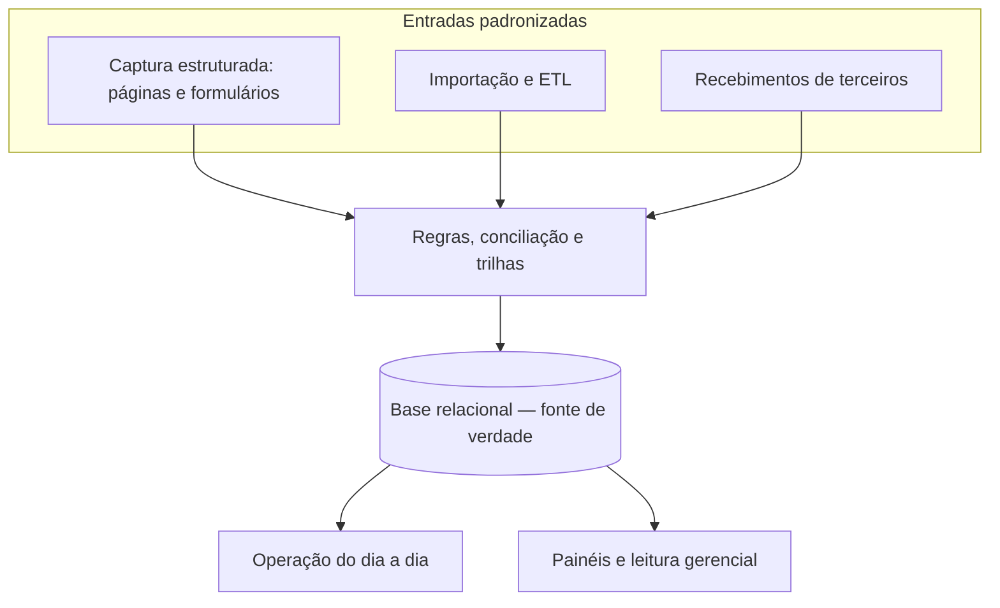

# Roteiro de PowerPoint - Sistema NPBB

Tese central: o sistema NPBB existe para centralizar informações em um banco de dados único e oferecer uma interface para operação, controle e leitura interna das ações.

## Slide 1 - O problema operacional
Objetivo: mostrar por que a operação precisa de uma base centralizada.

### Pontos no slide
- Informações de eventos, leads e ativos circulam em planilhas, e-mails e controles separados
- A operação depende de consolidação manual entre áreas, proponentes e ticketeiras
- O acompanhamento das ações fica mais lento e mais sujeito a inconsistências
- A leitura gerencial costuma depender de reconstrução posterior dos dados

## Slide 2 - Custo de não fazer
Objetivo: explicitar os efeitos operacionais de manter a rotina fragmentada.

### Pontos no slide
- A equipe continua gastando tempo conciliando versões de informações, em vez de concentrar esforço na operação das ações
- O risco de erro aumenta porque leads, ativos e registros do evento circulam por fluxos diferentes antes de chegarem a uma visão consolidada
- O acompanhamento do dia a dia fica mais lento, porque cada consulta depende de buscar, comparar e validar dados em fontes separadas
- A leitura gerencial perde consistência, já que os relatórios passam a depender de reconstrução posterior e não de uma base única atualizada
- À medida que o volume cresce, o núcleo acumula mais retrabalho, mais atraso de resposta e mais dificuldade para sustentar controle sobre as ações

## Slide 3 - Por que agora?
Objetivo: mostrar a urgência de unificar a operação antes que o passivo aumente.

### Pontos no slide
- O núcleo está acumulando eventos, ativações, leads e fluxos operacionais que já precisam ser administrados de forma articulada
- Quanto mais tempo essa operação demora para ficar unificada e integrada, maior fica o passivo de erro, atraso e reconciliação manual
- O crescimento do volume sem uma base única torna mais difícil manter controle, rastreabilidade e consulta rápida sobre o que está em andamento
- Estruturar essa integração agora evita que a expansão da operação continue apoiada em rotinas frágeis e dispersas
- A unificação passa a ser necessária para sustentar a operação com mais previsibilidade, mais consistência de dado e menos dependência de reconstrução posterior

## Slide 4 - O cenário ideal
Objetivo: descrever o estado desejado antes de entrar nos módulos do NPBB.

### Pontos no slide
- Uma fonte de verdade em banco de dados relacional: eventos, ativações, leads e ativos ligados entre si, em vez de versões dispersas em planilhas e e-mail
- Informação relacionada de ponta a ponta — do planejamento ao recebimento, distribuição e acompanhamento, com histórico e rastreabilidade (operar e auditar sem reconstruir o fluxo depois)
- Automação e padronização onde hoje há trabalho manual — importação, conciliação e regras de negócio consistentes, reduzindo retrabalho e erro humano; a operação deixa de depender de planilha paralela como referência
- Operação e leitura gerencial sobre a mesma base — painéis e indicadores refletem dados consolidados no sistema, não consolidações ad hoc

### Diagrama sugerido (slide)

## Slide 5 - A lógica do sistema
Objetivo: explicar como o NPBB aproxima a operação do cenário ideal e a razão de ser da ferramenta.

### Pontos no slide
- O sistema organiza as informações em um banco de dados único
- A interface permite cadastrar, consultar, atualizar e acompanhar essas informações
- A mesma base atende a operação do dia a dia e a leitura interna dos resultados
- Isso reduz etapas manuais e melhora o controle sobre o que foi registrado

## Slide 6 - Cadastro de eventos e ativações
Objetivo: apresentar a base operacional do fluxo.

### Pontos no slide
- O cadastro de eventos organiza o ponto de partida de cada ação
- As ativações ficam vinculadas a esses eventos dentro da mesma estrutura
- Isso concentra em um só lugar as informações necessárias para operar cada ação
- Eventos e ativações passam a servir de base para leads, ativos, formulários e dashboards

## Slide 7 - Landing pages integradas ao banco de dados
Objetivo: explicar como a captação entra diretamente na base do sistema.

### Pontos no slide
- O sistema gera landing pages vinculadas a eventos e ativações
- Essas páginas recebem leads já integrados ao banco de dados do NPBB
- Isso reduz a dependência de repasses manuais de planilhas por terceiros
- O núcleo passa a ter mais controle sobre origem, registro e qualidade do dado captado

## Slide 8 - Cadastro e gestão de ativos
Objetivo: mostrar o apoio operacional na distribuição e acompanhamento de ingressos.

### Pontos no slide
- O sistema registra os ativos de cada evento dentro da mesma base centralizada
- A interface apoia a disponibilização, o acompanhamento e a retirada ou distribuição desses ativos
- Isso permite controlar melhor o que foi recebido, disponibilizado, distribuído e utilizado
- O processo fica menos dependente de controles paralelos e mais visível para a operação

## Slide 9 - Gestão de leads e importação com ETL
Objetivo: mostrar como os leads passam a ser tratados dentro de um fluxo único.

### Pontos no slide
- Os leads captados nas landing pages entram diretamente no banco de dados do sistema
- Leads recebidos de proponentes ou ticketeiras também podem ser importados para essa mesma base
- O processo de ETL organiza, padroniza e consolida essas informações
- Isso reduz etapas manuais e melhora o controle sobre a qualidade dos leads
- Formulários, pesquisas e outras coletas podem alimentar a mesma base de dados

## Slide 10 - Dashboards internos e externos
Objetivo: mostrar que os dashboards decorrem da base já consolidada.

### Pontos no slide
- Como as informações estão centralizadas, o banco de dados pode ser usado como fonte para dashboards
- Isso facilita a criação de painéis internos de acompanhamento operacional e gerencial
- Também permite estruturar leituras externas quando houver essa necessidade
- Os dashboards passam a refletir dados consolidados, e não compilações manuais isoladas

## Slide 11 - Por que o sistema é necessário para o núcleo
Objetivo: encerrar reforçando a função operacional da ferramenta.

### Pontos no slide
- O sistema existe para organizar a operação em uma base única e controlada
- Ele concentra eventos, ativações, ativos e leads em um mesmo ambiente de trabalho
- Isso dá mais clareza para operar, acompanhar e consultar as informações das ações
- A mesma base operacional passa a sustentar a análise e os dashboards do núcleo
